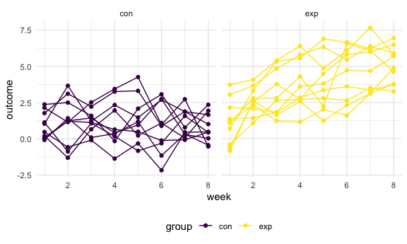
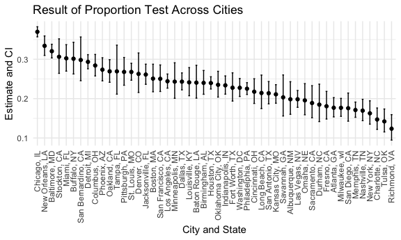
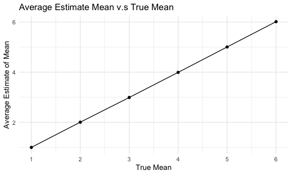
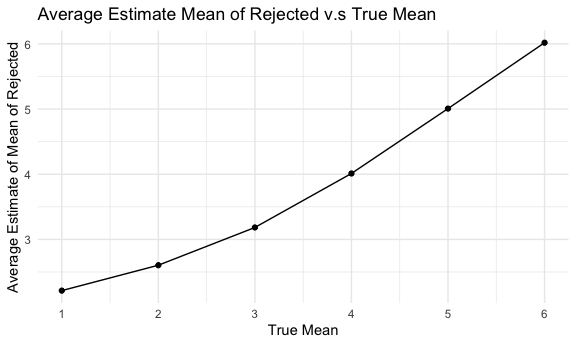

Homework 5
================

### Problem 1

The code chunk below imports the data in individual spreadsheets
contained in `./data/zip_data/`. To do this, I create a dataframe that
includes the list of all files in that directory and the complete path
to each file. As a next step, I `map` over paths and import data using
the `read_csv` function. Finally, I `unnest` the result of `map`.

``` r
full_df = 
  tibble(
    files = list.files("data/zip_data/"),
    path = str_c("data/zip_data/", files)
  ) %>% 
  mutate(data = map(path, read_csv)) %>% 
  unnest()
```

The result of the previous code chunk isn’t tidy – data are wide rather
than long, and some important variables are included as parts of others.
The code chunk below tides the data using string manipulations on the
file, converting from wide to long, and selecting relevant variables.

``` r
tidy_df = 
  full_df %>% 
  mutate(
    files = str_replace(files, ".csv", ""),
    group = str_sub(files, 1, 3)) %>% 
  pivot_longer(
    week_1:week_8,
    names_to = "week",
    values_to = "outcome",
    names_prefix = "week_") %>% 
  mutate(week = as.numeric(week)) %>% 
  select(group, subj = files, week, outcome)
```

Finally, the code chunk below creates a plot showing individual data,
faceted by group.

``` r
tidy_df %>% 
  ggplot(aes(x = week, y = outcome, group = subj, color = group)) + 
  geom_point() + 
  geom_path() + 
  facet_grid(~group)
```



This plot suggests high within-subject correlation – subjects who start
above average end up above average, and those that start below average
end up below average. Subjects in the control group generally don’t
change over time, but those in the experiment group increase their
outcome in a roughly linear way.

## Problem 2

The raw data has 52179 observations of 12 variables, containing date,
victim’s age, gender, race, sex, name, location, and disposition of the
case.

``` r
homicide_df =
  read_csv("./data/homicide-data.csv") %>% 
  mutate(
    city_state = str_c(city, ", ", state)
  )
```

Below is a data frame showing number of total cases and unsolved cases
for each city.

``` r
unsolved_df =
  homicide_df %>% 
  group_by(city_state) %>% 
  summarize(total = n(), unsolved = sum(str_count(disposition, c("Closed without arrest", "Open/No arrest"))))

unsolved_df
```

    ## # A tibble: 51 × 3
    ##    city_state      total unsolved
    ##    <chr>           <int>    <int>
    ##  1 Albuquerque, NM   378       75
    ##  2 Atlanta, GA       973      172
    ##  3 Baltimore, MD    2827      906
    ##  4 Baton Rouge, LA   424      102
    ##  5 Birmingham, AL    800      192
    ##  6 Boston, MA        614      154
    ##  7 Buffalo, NY       521      157
    ##  8 Charlotte, NC     687      101
    ##  9 Chicago, IL      5535     2046
    ## 10 Cincinnati, OH    694      151
    ## # … with 41 more rows

Prop.test for Baltimore

``` r
baltimore_test =
  prop.test(906, 2827) %>% 
  broom::tidy() 
  
baltimore_test %>% 
  select(estimate, conf.low, conf.high)
```

    ## # A tibble: 1 × 3
    ##   estimate conf.low conf.high
    ##      <dbl>    <dbl>     <dbl>
    ## 1    0.320    0.303     0.338

Writing function for extracting prop.test estimate and CI

``` r
prop_test <- function(citystate){
  
   data <- unsolved_df %>% 
    filter(city_state == citystate) 
  
    result <- prop.test(data$unsolved, data$total) %>% 
    broom::tidy() %>% 
    select(estimate, conf.low, conf.high)

    result
}
```

Test for each city

``` r
test_results_df =
  expand_grid(
  citystate = unsolved_df$city_state
) %>% 
  mutate(
    results_df = map(citystate, prop_test)
  ) %>% 
  unnest(results_df)

test_results_df
```

    ## # A tibble: 51 × 4
    ##    citystate       estimate conf.low conf.high
    ##    <chr>              <dbl>    <dbl>     <dbl>
    ##  1 Albuquerque, NM    0.198    0.160     0.243
    ##  2 Atlanta, GA        0.177    0.154     0.203
    ##  3 Baltimore, MD      0.320    0.303     0.338
    ##  4 Baton Rouge, LA    0.241    0.201     0.285
    ##  5 Birmingham, AL     0.24     0.211     0.271
    ##  6 Boston, MA         0.251    0.217     0.287
    ##  7 Buffalo, NY        0.301    0.263     0.343
    ##  8 Charlotte, NC      0.147    0.122     0.176
    ##  9 Chicago, IL        0.370    0.357     0.383
    ## 10 Cincinnati, OH     0.218    0.188     0.251
    ## # … with 41 more rows

### Visualization for estimate and CI for each city

``` r
  test_results_df %>% 
  mutate(estimate = as.numeric(estimate)) %>% 
  mutate(citystate = fct_reorder(citystate, desc(estimate))) %>% 
  ggplot(aes(x = citystate, y = estimate)) + geom_point() + geom_errorbar(aes(ymin = conf.low, ymax = conf.high), position = "dodge", width = 0.25) + theme(axis.text.x = element_text(angle = 90, vjust = 0.5, hjust=1)) + labs(x = "City and State",y = "Estimate and CI",title = "Result of Proportion Test Across Cities")
```



## Question 3

Writing function for extracting t test estimate and p value

``` r
t_test = function(mu) {
  
  sim_data = tibble(
    x = rnorm(mean = mu, n = 30, sd = 5)
  )
  
  sim_result =
    t.test(sim_data) %>% 
    broom::tidy() %>% 
    select(estimate, p.value) 
}
```

for μ=0

``` r
mean0_df =
  expand_grid(
  mean = 0,
  iteration = 1:5000
) %>% 
  mutate(
    test_df = map(mean, t_test)
  ) %>% 
  unnest(test_df)
```

for μ=1:6

``` r
multimean_df =
  expand_grid(
  mean = c(1:6),
  iteration = 1:5000
) %>% 
  mutate(
    test_df = map(mean, t_test)
  ) %>% 
  unnest(test_df)
```

### Plot showing power of t.test and true value of mean

When we increase the mean and keep sigma set to 5, the effect size
(μ-0)/5 increase. As effect size increases, power of t.test also
increases, keeping null hypothesis the same.

``` r
multimean_df %>% 
  mutate(
    reject = ifelse(p.value < 0.05, 1, 0)
  ) %>% 
  group_by(mean) %>% 
  summarise(count = n(), reject_count = sum(reject), reject_proportion = reject_count/count) %>%
  ggplot(aes(x = mean, y = reject_proportion)) + geom_point() + geom_line() + labs(x = "True Mean",y = "Power of T.test",title = "Power of t.test v.s multiple means") + scale_x_continuous(limits = c(1,6), breaks = seq(1:6))
```


### Plot of average estimate mean and true value of mean

As power of test increased, the sample average of μ̂ across tests for
which the null is rejected becomes closer to true value of μ.They are
approximately equal to the true value of μ.

``` r
avg_plot1 =
  multimean_df %>% 
  group_by(mean) %>% 
  summarise(avg = mean(estimate)) %>%
  ggplot(aes(x = mean, y = avg)) + geom_point() + geom_line() + labs(x = "True Mean",y = "Average Estimate of Mean",title = "Average Estimate Mean v.s True Mean") + scale_x_continuous(limits = c(1,6), breaks = seq(1:6))

avg_plot2 = 
  multimean_df %>% 
  mutate(
    reject = ifelse(p.value < 0.05, 1, 0)
  )  %>% 
  filter(reject == 1) %>% 
  group_by(mean) %>% 
  summarise(avg = mean(estimate)) %>%
  ggplot(aes(x = mean, y = avg)) + geom_point() + geom_line() + labs(x = "True Mean",y = "Average Estimate of Mean of Rejected",title = "Average Estimate Mean of Rejected v.s True Mean") + scale_x_continuous(limits = c(1,6), breaks = seq(1:6))

avg_plot1 
```



``` r
avg_plot2
```


