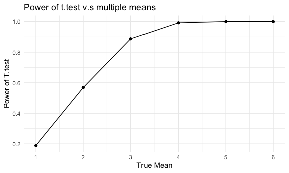

Homework 5
================

## Problem 2

The raw data has 52179 observations of 12 variables, containing date,
victim’s age, gender, race, sex, name, location, and disposition of the
case.

``` r
homicide_df =
  read_csv("./homicide-data.csv") %>% 
  mutate(
    city_state = str_c(city, ", ", state)
  )
```

``` r
homicide_df %>% 
  group_by(city_state) %>% 
  summarize(total = str_count(disposition), unsolved = (str_count(disposition, "Closed without arrest") + str_count(disposition, "Open/No arrest") ))
```

    ## # A tibble: 52,179 × 3
    ## # Groups:   city_state [51]
    ##    city_state      total unsolved
    ##    <chr>           <int>    <int>
    ##  1 Albuquerque, NM    21        1
    ##  2 Albuquerque, NM    16        0
    ##  3 Albuquerque, NM    21        1
    ##  4 Albuquerque, NM    16        0
    ##  5 Albuquerque, NM    21        1
    ##  6 Albuquerque, NM    14        1
    ##  7 Albuquerque, NM    16        0
    ##  8 Albuquerque, NM    16        0
    ##  9 Albuquerque, NM    14        1
    ## 10 Albuquerque, NM    14        1
    ## # … with 52,169 more rows

## Question 3

writing function

``` r
t_test = function(mu) {
  
  sim_data = tibble(
    x = rnorm(mean = mu, n = 30, sd = 5)
  )
  
  sim_result =
    t.test(sim_data) %>% 
    broom::tidy() %>% 
    select(estimate, p.value) 
}
```

for μ=0

``` r
mean0_df =
  expand_grid(
  mean = 0,
  iteration = 1:5000
) %>% 
  mutate(
    test_df = map(mean, t_test)
  ) %>% 
  unnest(test_df)
```

for μ=1:6

``` r
multimean_df =
  expand_grid(
  mean = c(1:6),
  iteration = 1:5000
) %>% 
  mutate(
    test_df = map(mean, t_test)
  ) %>% 
  unnest(test_df)
```

### plot showing power of t.test and true value of mean

When we increase the mean and keep sigma set to 5, the effect size
(μ-0)/5 increase. As effect size increases, power of t.test also
increases, keeping null hypothesis the same.

``` r
multimean_df %>% 
  mutate(
    reject = ifelse(p.value < 0.05, 1, 0)
  ) %>% 
  group_by(mean) %>% 
  summarise(count = n(), reject_count = sum(reject), reject_proportion = reject_count/count) %>%
  ggplot(aes(x = mean, y = reject_proportion)) + geom_point() + geom_line() + labs(x = "True Mean",y = "Power of T.test",title = "Power of t.test v.s multiple means") + scale_x_continuous(limits = c(1,6), breaks = seq(1:6))
```


