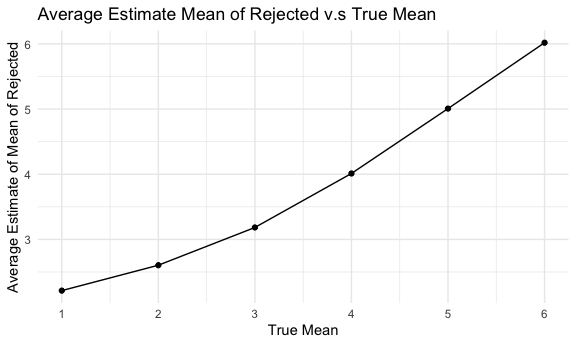

Homework 5
================

## Problem 2

The raw data has 52179 observations of 12 variables, containing date,
victim’s age, gender, race, sex, name, location, and disposition of the
case.

``` r
homicide_df =
  read_csv("./homicide-data.csv") %>% 
  mutate(
    city_state = str_c(city, ", ", state)
  )
```

``` r
unsolved_df =
  homicide_df %>% 
  group_by(city_state) %>% 
  summarize(total = n(), unsolved = sum(str_count(disposition, c("Closed without arrest", "Open/No arrest"))))
```

Prop.test for Baltimore

``` r
baltimore_test =
  prop.test(906, 2827) %>% 
  broom::tidy() 
  
baltimore_test %>% 
  select(estimate, conf.low, conf.high)
```

    ## # A tibble: 1 × 3
    ##   estimate conf.low conf.high
    ##      <dbl>    <dbl>     <dbl>
    ## 1    0.320    0.303     0.338

writing function for prop.test

``` r
prop_test <- function(citystate){
  
   data <- unsolved_df %>% 
    filter(city_state == citystate) 
  
    result <- prop.test(data$unsolved, data$total) %>% 
    broom::tidy() %>% 
    select(estimate, conf.low, conf.high)

    result
}
```

## Question 3

writing function

``` r
t_test = function(mu) {
  
  sim_data = tibble(
    x = rnorm(mean = mu, n = 30, sd = 5)
  )
  
  sim_result =
    t.test(sim_data) %>% 
    broom::tidy() %>% 
    select(estimate, p.value) 
}
```

for μ=0

``` r
mean0_df =
  expand_grid(
  mean = 0,
  iteration = 1:5000
) %>% 
  mutate(
    test_df = map(mean, t_test)
  ) %>% 
  unnest(test_df)
```

for μ=1:6

``` r
multimean_df =
  expand_grid(
  mean = c(1:6),
  iteration = 1:5000
) %>% 
  mutate(
    test_df = map(mean, t_test)
  ) %>% 
  unnest(test_df)
```

### Plot showing power of t.test and true value of mean

When we increase the mean and keep sigma set to 5, the effect size
(μ-0)/5 increase. As effect size increases, power of t.test also
increases, keeping null hypothesis the same.

``` r
multimean_df %>% 
  mutate(
    reject = ifelse(p.value < 0.05, 1, 0)
  ) %>% 
  group_by(mean) %>% 
  summarise(count = n(), reject_count = sum(reject), reject_proportion = reject_count/count) %>%
  ggplot(aes(x = mean, y = reject_proportion)) + geom_point() + geom_line() + labs(x = "True Mean",y = "Power of T.test",title = "Power of t.test v.s multiple means") + scale_x_continuous(limits = c(1,6), breaks = seq(1:6))
```


### Plot of average estimate mean and true value of mean

As power of test increased, the sample average of μ̂ across tests for
which the null is rejected becomes closer to true value of μ.They are
approximately equal to the true value of μ.

``` r
avg_plot1 =
  multimean_df %>% 
  group_by(mean) %>% 
  summarise(avg = mean(estimate)) %>%
  ggplot(aes(x = mean, y = avg)) + geom_point() + geom_line() + labs(x = "True Mean",y = "Average Estimate of Mean",title = "Average Estimate Mean v.s True Mean") + scale_x_continuous(limits = c(1,6), breaks = seq(1:6))

avg_plot2 = 
  multimean_df %>% 
  mutate(
    reject = ifelse(p.value < 0.05, 1, 0)
  )  %>% 
  filter(reject == 1) %>% 
  group_by(mean) %>% 
  summarise(avg = mean(estimate)) %>%
  ggplot(aes(x = mean, y = avg)) + geom_point() + geom_line() + labs(x = "True Mean",y = "Average Estimate of Mean of Rejected",title = "Average Estimate Mean of Rejected v.s True Mean") + scale_x_continuous(limits = c(1,6), breaks = seq(1:6))

avg_plot1 
```


``` r
avg_plot2
```


